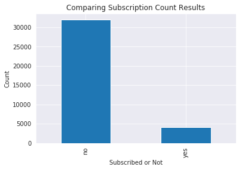
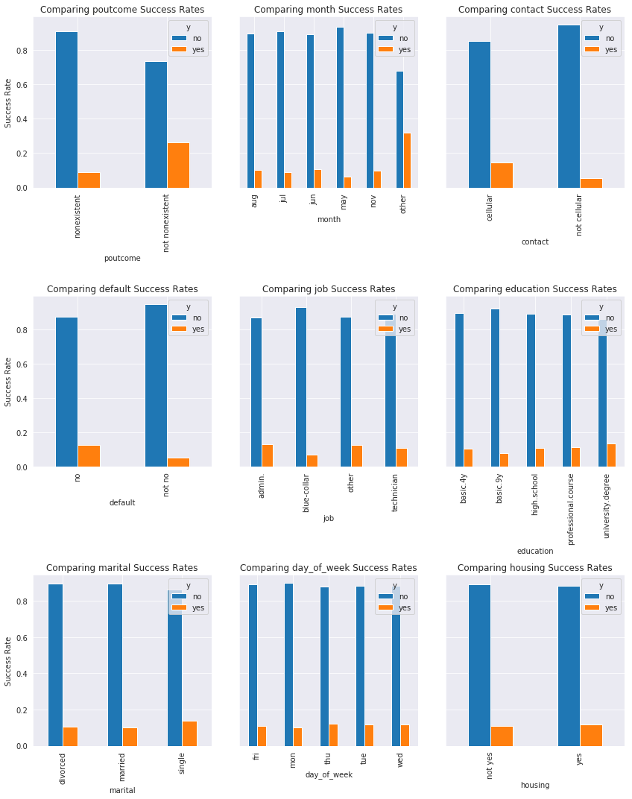
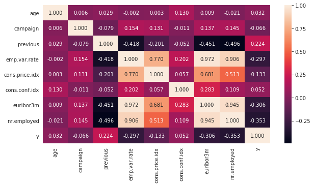
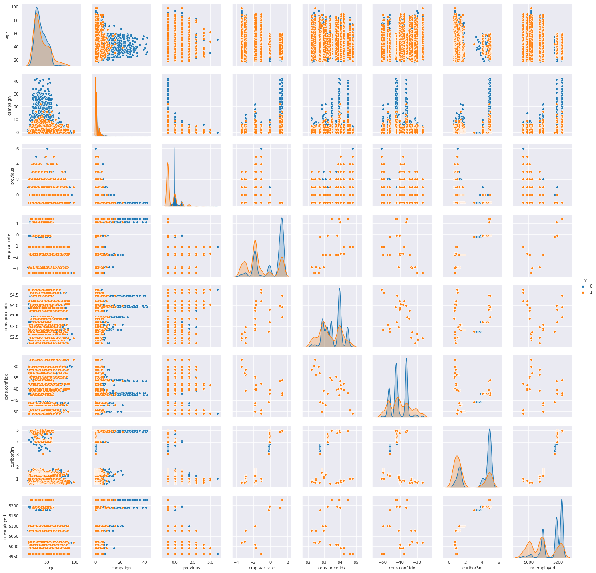
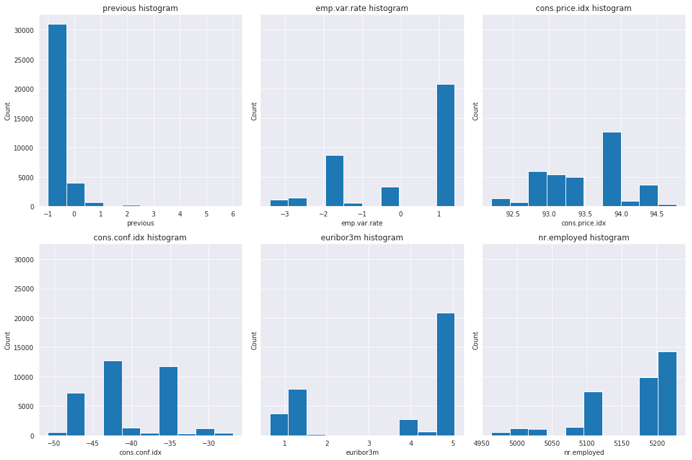

# Bank Predictioins

# Step 2: Discover


```python
import pandas as pd
import numpy as np
import seaborn as sns
import matplotlib.pyplot as plt
from statsmodels.stats.outliers_influence import variance_inflation_factor
import scipy.stats as sp
from sklearn.model_selection import train_test_split
from sklearn.linear_model import LogisticRegression

%matplotlib inline
```

## Obtaining the Data


```python
import sys

sys.path.insert(0, '/scripts/')
from scripts.helpers import load_data, find_outliers, classifier_categorical_variance, \
    plot_success_rates, bank_profit, cat_null_cleaner, cat_small_counts
from scripts.NaiveClassifier import NaiveClassifier
from scripts.Preprocessing import Preprocessing
```


```python
path = './raw_data/'
file = 'bank-full.csv'
bank_data = load_data(path=path, file=file, verbose=True, sep=';')
```

    --------------------------------bank-full shape---------------------------------
                                      (41188, 21)                                   
    
    
    ----------------------------bank-full's column types----------------------------
    age                 int64
    job                object
    marital            object
    education          object
    default            object
    housing            object
    loan               object
    contact            object
    month              object
    day_of_week        object
    duration            int64
    campaign            int64
    pdays               int64
    previous            int64
    poutcome           object
    emp.var.rate      float64
    cons.price.idx    float64
    cons.conf.idx     float64
    euribor3m         float64
    nr.employed       float64
    y                  object
    dtype: object
    
    
    ---------------------------bank-full first five rows----------------------------
       age        job  marital    education  default housing loan    contact  \
    0   56  housemaid  married     basic.4y       no      no   no  telephone   
    1   57   services  married  high.school  unknown      no   no  telephone   
    2   37   services  married  high.school       no     yes   no  telephone   
    3   40     admin.  married     basic.6y       no      no   no  telephone   
    4   56   services  married  high.school       no      no  yes  telephone   
    
      month day_of_week  ...  campaign  pdays  previous     poutcome emp.var.rate  \
    0   may         mon  ...         1    999         0  nonexistent          1.1   
    1   may         mon  ...         1    999         0  nonexistent          1.1   
    2   may         mon  ...         1    999         0  nonexistent          1.1   
    3   may         mon  ...         1    999         0  nonexistent          1.1   
    4   may         mon  ...         1    999         0  nonexistent          1.1   
    
       cons.price.idx  cons.conf.idx  euribor3m  nr.employed   y  
    0          93.994          -36.4      4.857       5191.0  no  
    1          93.994          -36.4      4.857       5191.0  no  
    2          93.994          -36.4      4.857       5191.0  no  
    3          93.994          -36.4      4.857       5191.0  no  
    4          93.994          -36.4      4.857       5191.0  no  
    
    [5 rows x 21 columns]


## Cleaning the Data

There is an incredibly small probability that any rows which are exactly the same represent two distinct clients, so I will be dropping any duplicated rows.


```python
bank_data.drop_duplicates(inplace=True)
bank_data.shape
```


    (41176, 21)


```python
bank_data.dropna(inplace=True)
bank_data.shape
```


    (41176, 21)


```python
bank_data.drop('duration', axis=1, inplace=True)
bank_data.head()
```


<div>
<style scoped>
    .dataframe tbody tr th:only-of-type {
        vertical-align: middle;
    }

    .dataframe tbody tr th {
        vertical-align: top;
    }

    .dataframe thead th {
        text-align: right;
    }
</style>
<table border="1" class="dataframe">
  <thead>
    <tr style="text-align: right;">
      <th></th>
      <th>age</th>
      <th>job</th>
      <th>marital</th>
      <th>education</th>
      <th>default</th>
      <th>housing</th>
      <th>loan</th>
      <th>contact</th>
      <th>month</th>
      <th>day_of_week</th>
      <th>campaign</th>
      <th>pdays</th>
      <th>previous</th>
      <th>poutcome</th>
      <th>emp.var.rate</th>
      <th>cons.price.idx</th>
      <th>cons.conf.idx</th>
      <th>euribor3m</th>
      <th>nr.employed</th>
      <th>y</th>
    </tr>
  </thead>
  <tbody>
    <tr>
      <th>0</th>
      <td>56</td>
      <td>housemaid</td>
      <td>married</td>
      <td>basic.4y</td>
      <td>no</td>
      <td>no</td>
      <td>no</td>
      <td>telephone</td>
      <td>may</td>
      <td>mon</td>
      <td>1</td>
      <td>999</td>
      <td>0</td>
      <td>nonexistent</td>
      <td>1.1</td>
      <td>93.994</td>
      <td>-36.4</td>
      <td>4.857</td>
      <td>5191.0</td>
      <td>no</td>
    </tr>
    <tr>
      <th>1</th>
      <td>57</td>
      <td>services</td>
      <td>married</td>
      <td>high.school</td>
      <td>unknown</td>
      <td>no</td>
      <td>no</td>
      <td>telephone</td>
      <td>may</td>
      <td>mon</td>
      <td>1</td>
      <td>999</td>
      <td>0</td>
      <td>nonexistent</td>
      <td>1.1</td>
      <td>93.994</td>
      <td>-36.4</td>
      <td>4.857</td>
      <td>5191.0</td>
      <td>no</td>
    </tr>
    <tr>
      <th>2</th>
      <td>37</td>
      <td>services</td>
      <td>married</td>
      <td>high.school</td>
      <td>no</td>
      <td>yes</td>
      <td>no</td>
      <td>telephone</td>
      <td>may</td>
      <td>mon</td>
      <td>1</td>
      <td>999</td>
      <td>0</td>
      <td>nonexistent</td>
      <td>1.1</td>
      <td>93.994</td>
      <td>-36.4</td>
      <td>4.857</td>
      <td>5191.0</td>
      <td>no</td>
    </tr>
    <tr>
      <th>3</th>
      <td>40</td>
      <td>admin.</td>
      <td>married</td>
      <td>basic.6y</td>
      <td>no</td>
      <td>no</td>
      <td>no</td>
      <td>telephone</td>
      <td>may</td>
      <td>mon</td>
      <td>1</td>
      <td>999</td>
      <td>0</td>
      <td>nonexistent</td>
      <td>1.1</td>
      <td>93.994</td>
      <td>-36.4</td>
      <td>4.857</td>
      <td>5191.0</td>
      <td>no</td>
    </tr>
    <tr>
      <th>4</th>
      <td>56</td>
      <td>services</td>
      <td>married</td>
      <td>high.school</td>
      <td>no</td>
      <td>no</td>
      <td>yes</td>
      <td>telephone</td>
      <td>may</td>
      <td>mon</td>
      <td>1</td>
      <td>999</td>
      <td>0</td>
      <td>nonexistent</td>
      <td>1.1</td>
      <td>93.994</td>
      <td>-36.4</td>
      <td>4.857</td>
      <td>5191.0</td>
      <td>no</td>
    </tr>
  </tbody>
</table>
</div>


Please refer to my discussion [here](./01_Define.ipynb#Dropping-'duration') for an explanation as to why I am dropping the column "duration." 

The description for *campaign* mentions that it includes the last contact with the client during this campaign. Since I am predicting whether they will be subscribing to a term deposit on their last contact, then I need to remove it from the column. The column *previous* also has this issue.


```python
bank_data['campaign'] -= 1
bank_data['previous'] -= 1
```


```python
bank_data[['campaign', 'previous']].describe()
```


<div>
<style scoped>
    .dataframe tbody tr th:only-of-type {
        vertical-align: middle;
    }

    .dataframe tbody tr th {
        vertical-align: top;
    }

    .dataframe thead th {
        text-align: right;
    }
</style>
<table border="1" class="dataframe">
  <thead>
    <tr style="text-align: right;">
      <th></th>
      <th>campaign</th>
      <th>previous</th>
    </tr>
  </thead>
  <tbody>
    <tr>
      <th>count</th>
      <td>41176.000000</td>
      <td>41176.000000</td>
    </tr>
    <tr>
      <th>mean</th>
      <td>1.567879</td>
      <td>-0.826987</td>
    </tr>
    <tr>
      <th>std</th>
      <td>2.770318</td>
      <td>0.494964</td>
    </tr>
    <tr>
      <th>min</th>
      <td>0.000000</td>
      <td>-1.000000</td>
    </tr>
    <tr>
      <th>25%</th>
      <td>0.000000</td>
      <td>-1.000000</td>
    </tr>
    <tr>
      <th>50%</th>
      <td>1.000000</td>
      <td>-1.000000</td>
    </tr>
    <tr>
      <th>75%</th>
      <td>2.000000</td>
      <td>-1.000000</td>
    </tr>
    <tr>
      <th>max</th>
      <td>55.000000</td>
      <td>6.000000</td>
    </tr>
  </tbody>
</table>
</div>


This shows that quite a lot of people have not been contacted during this current campaign. The -1 values in *previous* indicate that they were never contacted in a prior campaign. This data is already held in the *poutcome* value nonexistent.


```python
bank_data[bank_data['previous'] != -1].y.value_counts()
```


    no     4126
    yes    1499
    Name: y, dtype: int64


```python
bank_data[bank_data['poutcome'] != 'nonexistent'].y.value_counts()
```


    no     4126
    yes    1499
    Name: y, dtype: int64


I'll move on for now, but I may come back to investigate *previous* further.

### Cleaning the Data, Missing Values

I have dropped all null values from the dataframe above utilizing the *dropna* method. But, this only takes care of values for which pandas recognizes a missing value (generally the None python object or np.nan). There currently are values in the data which are unknown, and I need to decide whether or not I need to fix this. An example of this type of unknown is *pdays* value of 999 as can be seen in the brief look at the data above. These values need to either be imputed, removed, or potentially left alone to help with the performance of the models.


```python
clean_cols = {'poutcome': 'nonexistent',
              'job': 'unknown',
              'marital': 'unknown',
              'education': 'unknown',
              'default': 'unknown',
              'housing': 'unknown',
              'loan': 'unknown'}
drop_cols, drop_rows = cat_null_cleaner(df=bank_data, null_vals=clean_cols, target='y')
print(drop_cols)
```

    []


```python
bank_data.shape
```


    (41176, 20)


```python
rows_to_drop = set([])
for rows in drop_rows:
    rows_to_drop |= set(rows.values)
bank_data.drop(rows_to_drop, inplace=True)
bank_data.drop(drop_cols, axis=1, inplace=True)
bank_data.shape
```


    (38234, 20)


#### Cleaning the Data, Missing Values, pdays


```python
bank_data[bank_data.pdays==999].shape[0] / bank_data.shape[0]
```


    0.9642726369200189


Roughly 96% of the pdays column is the value 999. All of these customers were never previously contacted in a campaign. This data has already been captured in the *poutcome* feature since their previous outcome would just be "nonexistent." I believe it is safe to asssume that this column can be dropped without much consequence.


```python
bank_data[(bank_data.poutcome=='nonexistent') & (bank_data.pdays==999)].shape[0] / \
    bank_data[bank_data.poutcome=='nonexistent'].shape[0]
```


    1.0


```python
bank_data.drop('pdays', axis=1, inplace=True)
```

Now, I need to group the smaller counts of data together so that I'm not losing information and ensuring there is enough data for each smaller count for the algorithms to learn something. For example, the 3 clients who are in default won't really add much to the data set.


```python
cat_cols = [x for x in bank_data.columns if bank_data[x].dtype==object and x != 'y']

for col in cat_cols:
    print(f"Column name: {col}")
    print(bank_data[col].value_counts() / bank_data[col].shape[0])
    print()
```

    Column name: job
    admin.           0.259821
    blue-collar      0.223858
    technician       0.166763
    services         0.097139
    management       0.071350
    retired          0.041220
    entrepreneur     0.035570
    self-employed    0.035283
    housemaid        0.025815
    unemployed       0.025187
    student          0.017994
    Name: job, dtype: float64
    
    Column name: marital
    married     0.606188
    single      0.281320
    divorced    0.112491
    Name: marital, dtype: float64
    
    Column name: education
    university.degree      0.309070
    high.school            0.241696
    basic.9y               0.153162
    professional.course    0.133311
    basic.4y               0.104671
    basic.6y               0.057619
    illiterate             0.000471
    Name: education, dtype: float64
    
    Column name: default
    no         0.797065
    unknown    0.202856
    yes        0.000078
    Name: default, dtype: float64
    
    Column name: housing
    yes    0.538081
    no     0.461919
    Name: housing, dtype: float64
    
    Column name: loan
    no     0.844144
    yes    0.155856
    Name: loan, dtype: float64
    
    Column name: contact
    cellular     0.639012
    telephone    0.360988
    Name: contact, dtype: float64
    
    Column name: month
    may    0.334571
    jul    0.173301
    aug    0.152221
    jun    0.126746
    nov    0.101925
    apr    0.063687
    oct    0.017210
    sep    0.013130
    mar    0.012999
    dec    0.004211
    Name: month, dtype: float64
    
    Column name: day_of_week
    thu    0.209421
    mon    0.207276
    wed    0.198828
    tue    0.195559
    fri    0.188916
    Name: day_of_week, dtype: float64
    
    Column name: poutcome
    nonexistent    0.864545
    failure        0.102945
    success        0.032510
    Name: poutcome, dtype: float64
    


```python
cat_small_counts(df=bank_data, cat_cols=cat_cols, min_frac=.1, max_frac=.9, inplace=True)
for col in cat_cols:
    print(f"Column name: {col}")
    print(bank_data[col].value_counts())
    print()
```

    Column name: job
    other          12769
    admin.          9785
    blue-collar     7167
    technician      6292
    Name: job, dtype: int64
    
    Column name: marital
    married     21451
    single      10437
    divorced     4125
    Name: marital, dtype: int64
    
    Column name: education
    university.degree      11817
    high.school             9241
    basic.9y                5856
    professional.course     5097
    basic.4y                4002
    Name: education, dtype: int64
    
    Column name: default
    no        29076
    not no     6937
    Name: default, dtype: int64
    
    Column name: housing
    yes        19407
    not yes    16606
    Name: housing, dtype: int64
    
    Column name: loan
    no        30383
    not no     5630
    Name: loan, dtype: int64
    
    Column name: contact
    cellular        23199
    not cellular    12814
    Name: contact, dtype: int64
    
    Column name: month
    may      11796
    jul       6193
    aug       5676
    jun       4534
    other     4078
    nov       3736
    Name: month, dtype: int64
    
    Column name: day_of_week
    thu    7527
    mon    7519
    wed    7121
    tue    7028
    fri    6818
    Name: day_of_week, dtype: int64
    
    Column name: poutcome
    nonexistent        31092
    not nonexistent     4921
    Name: poutcome, dtype: int64
    


If a category was less than 10% of the data, then it was either combined with other smaller categories to create an "other" value or it was removed from the data. In the case that a category dominated the data so much, then it was changed into a binary feature rather than 3 small-ish categories with one large one. 

## Exploring the Data

The first thing I want to do is to compare the counts of whether a client subscribed or not to a term deposit. This is to make sure that both subscribed and not subscribed will be equally represented in the model.


```python
target_col = bank_data['y']
count = target_col.value_counts()

sns.set_style("darkgrid")
ax = count.plot(kind='bar')
ax.set_ylabel("Count")
ax.set_xlabel("Subscribed or Not")
ax.set_title("Comparing Subscription Count Results")


print(f'Rejection rate: {count["no"] / count.sum():.3f}%')
print(f'Subscription rate: {count["yes"] / count.sum():.3f}%')
print(f'Number of Subscribers: {count["yes"]}')
print(f'Number of Rejections: {count["no"]}')
```

    Rejection rate: 0.887%
    Subscription rate: 0.113%
    Number of Subscribers: 4073
    Number of Rejections: 31940





As expected for a marketing campaign, the number of rejections clearly outweigh the number of people who subscribed to a term deposit with roughly 89% of the data being rejections. To get a more accurate model, it would be best to make it so that both the positive and negative results are roughly equivalent. I can achieve this by either downsampling the rejections or upsampling the subscriptions. I will be upsampling the subscriptions because there would be too large of a loss of information if I took a random sample of the rejections. The method I will be using to upsample the data is [SMOTE](https://en.wikipedia.org/wiki/Oversampling_and_undersampling_in_data_analysis#SMOTE), and it will be applied to the training data after it has been preprocessed and split into training and validation data in the next notebook.

### Exploring the Data, Categorical Features

There could potentially be a few numerical columns that should be used as categorical features based on their number of unique values.


```python
num_unique = bank_data.drop(columns='y').nunique()
num_unique
```


    age                76
    job                 4
    marital             3
    education           5
    default             2
    housing             2
    loan                2
    contact             2
    month               6
    day_of_week         5
    campaign           41
    previous            8
    poutcome            2
    emp.var.rate       10
    cons.price.idx     26
    cons.conf.idx      26
    euribor3m         314
    nr.employed        11
    dtype: int64


```python
cat_cols = num_unique[num_unique < 8].index
bank_data[cat_cols] = bank_data[cat_cols].astype('str')
```

I chose to only hve objects with less than 8 unique values become categorical values because most of the low frequency numerical columns will have a right skewed distribution where the higher the number, the more likely it is that they have decided to subscribe to a term deposit. I want to ensure that these lower frequency values will be used properly in the classification. This cannot happen if the feature is categorical rather than numerical. If I decide to make some of the numerical columns closer to categorical columns, I will utilize binning.


```python
num_unique = bank_data.drop(columns='y').nunique()
cat_cols = num_unique[num_unique < 8].index
cat_small_counts(df=bank_data, cat_cols=list(cat_cols), min_frac=.03, max_frac=.9, inplace=True)
cat_variances = classifier_categorical_variance(df=bank_data, 
                                                cat_cols=cat_cols,
                                                target_col='y', pos_val='yes')
cat_variances
```


<div>
<style scoped>
    .dataframe tbody tr th:only-of-type {
        vertical-align: middle;
    }

    .dataframe tbody tr th {
        vertical-align: top;
    }

    .dataframe thead th {
        text-align: right;
    }
</style>
<table border="1" class="dataframe">
  <thead>
    <tr style="text-align: right;">
      <th></th>
      <th>no</th>
      <th>yes</th>
    </tr>
  </thead>
  <tbody>
    <tr>
      <th>poutcome</th>
      <td>0.0150641</td>
      <td>0.0150641</td>
    </tr>
    <tr>
      <th>month</th>
      <td>0.00879085</td>
      <td>0.00879085</td>
    </tr>
    <tr>
      <th>contact</th>
      <td>0.0043874</td>
      <td>0.0043874</td>
    </tr>
    <tr>
      <th>default</th>
      <td>0.00295492</td>
      <td>0.00295492</td>
    </tr>
    <tr>
      <th>job</th>
      <td>0.00080938</td>
      <td>0.00080938</td>
    </tr>
    <tr>
      <th>education</th>
      <td>0.000448642</td>
      <td>0.000448642</td>
    </tr>
    <tr>
      <th>marital</th>
      <td>0.000375887</td>
      <td>0.000375887</td>
    </tr>
    <tr>
      <th>day_of_week</th>
      <td>6.71773e-05</td>
      <td>6.71773e-05</td>
    </tr>
    <tr>
      <th>housing</th>
      <td>2.03614e-05</td>
      <td>2.03614e-05</td>
    </tr>
    <tr>
      <th>loan</th>
      <td>6.97616e-06</td>
      <td>6.97616e-06</td>
    </tr>
  </tbody>
</table>
</div>


As we can see, there is a greater variety in outcome rate for variables *poutcome* and *month* whereas features *day_of_week*, *housing*, and *loan* don't vary much at all. The variables with low variance will be quite useless when doing the analysis and can be safely removed from the dataset.


```python
plot_success_rates(df=bank_data, cat_cols=cat_variances.index[:9], target_col='y', num_cols=3)
```





### Exploring the Data, Numeric Features


```python
from sklearn.preprocessing import LabelEncoder

le = LabelEncoder()

bank_data['y'] = le.fit_transform(bank_data.y)
# test = bank_data.pdays.replace(to_replace=999, value=20)
num_bank_data = bank_data[
    [x for x in bank_data.columns if x not in cat_cols or x =='y']] \
    .copy()

fig, ax = plt.subplots(figsize=(10, 5))

sns.heatmap(num_bank_data.corr(), annot=True, fmt='.3f')
```


    <matplotlib.axes._subplots.AxesSubplot at 0x7f4d5f41f630>





It looks like values like *age* and *campaign* do not really help us explain anything about the subscribers. I will make some plots to see if they agree.


```python
sns.pairplot(num_bank_data, vars=num_bank_data.columns.drop('y'), hue='y')
```


    <seaborn.axisgrid.PairGrid at 0x7f4d5f2a9898>





This visualization is going to help me understand how the different variables interact with eachother as well as how the data is spread between the subscribed and not subscribed for each variable. The diagonal plots illustrate this spread. Key things to look for is when the the two colors are highly separated, preferably more orange and less blue. These areas will display for what values there were more people subscribing to term deposits than not. Take for instance *nr.employed* in the bottom right. At around 5000, there was a much larger fraction of clients subscribing for term deposits than not.

This plot also illustrates why features like *age* and *campaign* do not have a high correlation. There is relatively low separation with both of these values, and they should safely be dropped.


```python
bank_data.drop(columns=['age', 'campaign'], inplace=True)
```


```python
from math import ceil
def plot_histograms(df, cols, fig_num_cols=3):
    n_cols = fig_num_cols
    n = len(cols)
    n_rows = ceil(n/n_cols)
    fig, axes = plt.subplots(n_rows, n_cols, figsize=(15, 5*n_rows), sharey=True)
    
    for col, ax in zip(cols, axes.flatten()):
        df[col].hist(ax=ax)
        ax.set_xlabel(col)
        ax.set_ylabel('Count')
        ax.set_title(f'{col} histogram')
    
    for i in range(n, len(axes.flatten())):
        fig.delaxes(axes.flatten()[i])
    
    plt.tight_layout()
    plt.show()
    return axes
```


```python
hists = plot_histograms(df=bank_data, cols=num_bank_data.columns.drop(['y', 'age', 'campaign']))
```





```python
binned_cols = {'nr.employed': 3, 'cons.conf.idx': 4, 'cons.price.idx': 2}
```

The binned columns above seem to be the most appropriate due to the distributions of each feature. I've only binned these because they have a variety of values for each bin. Also, lower counts like *previous* are better left as purely numeric. *euribor3m* has such a tight distribution that splitting it into 2 bins (2 due to the bimodal distribution) would make me lose information.

## Establishing a Baseline Outcome

To illustrate how accuracy can be a misleading metric, I will measure it for a model which would clearly be horrible for the bank to implement.


```python
from sklearn.model_selection import train_test_split
from sklearn.preprocessing import LabelBinarizer

X_train, X_test, y_train, y_test = train_test_split(
    bank_data.drop('y', axis=1), 
    bank_data['y'],
    random_state=1234)

lb = LabelBinarizer()
lb.fit_transform(y_train)
y_test = pd.Series(lb.transform(y_test).ravel(), name='y')

nc = NaiveClassifier()
nc.fit(X_train, y_train)
y_pred = nc.predict(X_test)

np.unique(y_pred, return_counts=True)
```


    (array([0]), array([9004]))


Alright, my naive model has predicted the majority case of *not subscribed* for every client in the test data. Now, I need to calculate the accuracy and profit score for the naive model.


```python
from sklearn.metrics import accuracy_score

acc = accuracy_score(y_test, y_pred)
profit = bank_profit(y_test, y_pred)

print(f"Accuracy: {acc:.2f}")
print(f"Profit Score: {profit:.2f}")
```

    Accuracy: 0.89
    Profit Score: 0.00


If I had naively assumed accuracy to be the best measurement for the classifier, I might have seen .90 accuracy and rejoiced in the outcome. But, profit score gives a much bleaker result for the model. The score is quite abysmal, and it is an indication that the model should never be put into production. 

Let's observe for a quick moment what this naive classifier would mean from the context of this problem. Each client would be predicted to be someone not worth calling. This would lead to absolutely no clients subscribing to term deposits ultimately drying up a large source of revenue for the bank. But, hey, at least the model was correct a lot of the time.

Since that doesn't give the best baseline for my models, I will make predictions of what the bank currently does now: mark everyone as positive.


```python
y_pred = np.ones(y_test.shape[0])
profit = bank_profit(y_test, y_pred)
max_profit = bank_profit(y_test, y_test)

print(f"Bank's current projected profit score: {profit:.2f}")
print(f"Bank's maximal profit score: {max_profit:.2f}")
```

    Bank's current projected profit score: 0.50
    Bank's maximal profit score: 1.00


As we can see, there appears to be an opportunity to double the bank's profit by minimizing the lost revenue from false positives.

## Hypothesizing Solutions

The first model that I will be utilizing for this analysis is a simple **Logistic Regression**. This is generally how a company might attempt the problem without needing to get into more complex machine learning algorithms. It is a quick and easy model to use, and it might end up meeting all the requirements for the problem at hand. Simpler does not mean worse by any means. The second model I will be trying out is **Gradient Boosting**. Due to the high amount of categorical columns, I believe a more optimized decision tree algorithm will do well. It is rather robust while also not taking too long for calculations (heavily depends on the hyperparameters, but there is obvious diminishing returns before this happens). The last model I'll be using is a **Random Forest Classifier**. The Random Forest is an incredibly robust algorithm which can be tuned to create accurate models by utilizing weak learners. The robustness of the model makes it much easier to create a generalized model.

In this analysis, I expect the numeric features to provide a greater amount of useful information because they can better track how the economy is doing at the time of calling clients.


```bash
%%bash
if [ -d "./cleaned_data" ]; then rm -R cleaned_data; fi
mkdir cleaned_data
```


```python
bank_data.to_csv('./cleaned_data/bank-full.csv')
```
